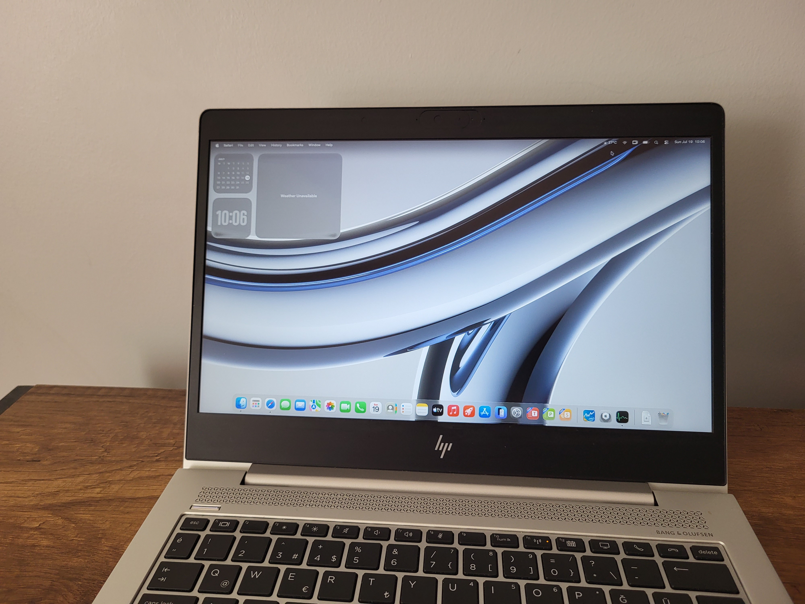

# Tahoe-on-Elitebook-G6
Ready made [OpenCore](https://dortania.github.io/OpenCore-Install-Guide/) EFI files for running macOS Tahoe on HP Elitebook G6.
## Tested and succeeded on an Elitebook 830 G6 with the following specs:
- **CPU:** Intel Core i5-8365u
- **GPU:** Intel UHD Graphics 620
- **Storage:** Intel 660p 512 GB NVMe SSD
- **Networking:** Intel AX200
- *RAM(irrelevant):* 2x8 GB 2400 MHz DDR4

## What works:
- Graphics acceleration
- CPU power management (via [CPUFriend](https://github.com/acidanthera/CPUFriend/tree/master))
- Internal speakers (via [AppleHDA-back-on-macOS-26-Tahoe](https://github.com/perez987/AppleHDA-back-on-macOS-26-Tahoe))
- Sleep/Wake
- Internal camera
- Hotkeys
- Touchpad/Gestures
- Trackpoint
- Digital audio
- Wi-Fi (via [itlwm](https://github.com/OpenIntelWireless/itlwm) and [HeliPort](https://github.com/OpenIntelWireless/heliport)) **(Requires ethernet during installation)**
## What doesn't work:
- Internal microphone (**will not** work due to Intel's SST)
- Bluetooth (**might work**, i just couldn't get it to)
- HDMI output (**can work** with [iGPU patching](https://dortania.github.io/OpenCore-Post-Install/gpu-patching/intel-patching/busid.html#parsing-the-framebuffer))
- Apple's continuity features (**untested** but will not work with an Intel card)

## What to look out for:
- SMBIOS needs to be set to a model compatible with macOS Tahoe **during the installation** (MacBookPro16,2 for my instance) and then needs to be switched to a more compatible model *with your device* (MacBookPro15,4 for me) **after the installation**
- Serial numbers should be generated using [GenSMBIOS](https://github.com/corpnewt/gensmbios)
- Installer should be created according to [Dortania's guide](https://dortania.github.io/OpenCore-Install-Guide/), then the EFI folder be replaced with this
- This EFI is not guaranteed to work with your 830 G6 as there is quite a bit of hardware variation in this model (like SSD, network card, CPU, GPU, screen)
- This EFI **might or might not work** with 840 and 850 G6 models
- This is not a guide nor a guaranteed way of doing it, I recommend treating it as a close baseline and nothing more
- You **might or might not** need to generate your own [SSDT](https://dortania.github.io/Getting-Started-With-ACPI/)'s using [SSDTTime](https://github.com/corpnewt/ssdttime)

## How to use:
```bash 
git clone https://github.com/rda-6/Tahoe-on-Elitebook-G6
cd Tahoe-on-Elitebook-G6
cp -r EFI /path/to/your/usb
```
into your terminal
**or**
download from the *Releases* and extract
into your installation USB




